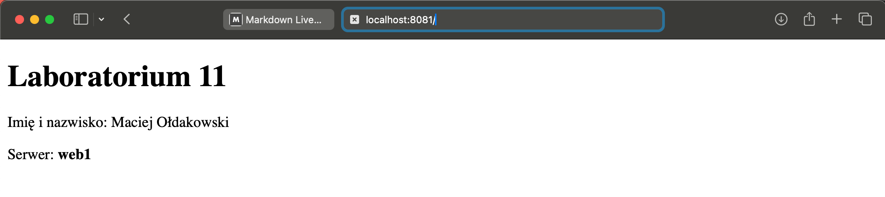

# Sprawozdanie lab11

## Maciej Ołdakowski

 W tym zadaniu musielimy stworzyć 3 kontenery o nastepujacych nazwach: web1, web2, web3 oparte na serwerze nginx, tak aby wszystkie te kontenery były dostępne z sieci zewnętrznej. Te serwery mają wyświetlać prosty plik html oraz maja zapisywać logi poszczególnych kontenerów.

 Poniżej znajduję się rozwiązanie tego zadania

 ### Struktura plików
 ``` bash
├── kontener1
│ ├── html
│ │ └── index.html
│ └── logs
│   ├── access.log
│   └── error.log
├── kontener2
│ ├── html
│ │ └── index.html
│ └── logs
│     ├── access.log
│     └── error.log
└── kontener3
    ├── html
    │ └── index.html
    └── logs
        ├── access.log
        └── error.log
 ```

 ### Wygląd pliku index.html
 ``` html 
 <!DOCTYPE html>
<html lang="pl">
<head>
    <meta charset="UTF-8">
    <title>Laboratorium 11 – web1</title>
</head>
<body>
    <h1>Laboratorium 11</h1>
    <p>Imię i nazwisko: Maciej Ołdakowski</p>
    <p>Serwer: <strong>web1</strong></p>
</body>
</html>
 ```

 ### Utworzenie sieci mostkowej 

 ``` bash 
 docker network create --driver bridge lab11net
 ```


 ### Utworzenie kontenera (dla web2 i web3 tak samo, tylko zmieniono porty na odpowiednio 8082 i 8083)

 ``` bash
docker run -d --name web1 --network lab11net -p 8081:80 
  -v ~/lab11/web1/html/index.html:/usr/share/nginx/html/index.html:ro \
  -v ~/lab11/web1/logs:/var/log/nginx \
  nginx:latest
 ```


 ### Wyświetlanie kontenerów

 
 
 


 ### Sprawdzenie czy kontenery sa w jednej sieci

 

